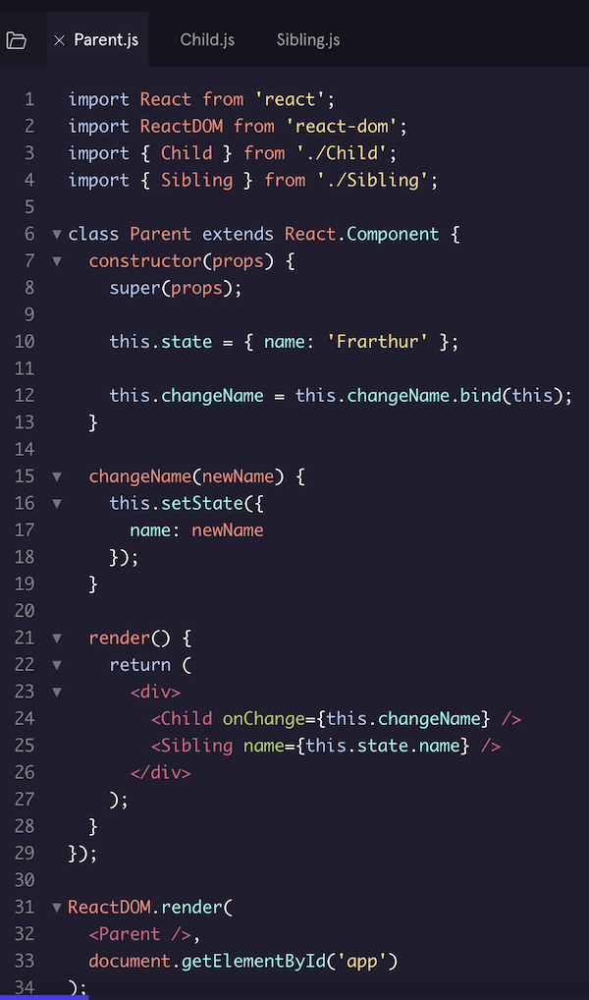
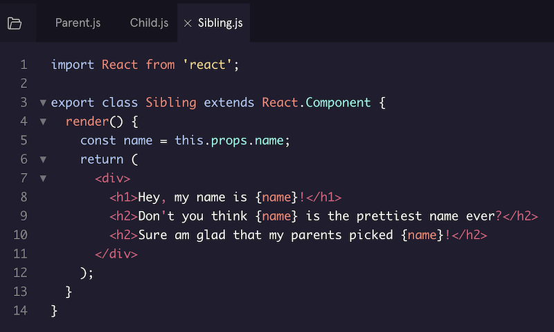

## Stateless Components Inherit From Stateful Components Recap

You just executed your first complete React programming pattern!

Let’s review. Follow each step in the code editor:

* A stateful component class defines a function that calls `this.setState`. (Parent.js, lines 15-19)

* The stateful component passes that function down to a stateless component. (Parent.js, line 24)

* That stateless component class defines a function that calls the passed-down function, and that can take an event object as an argument. (Child.js, lines 10-13)

* The stateless component class uses this new function as an event handler. (Child.js, line 20)

* When an event is detected, the parent’s state updates. (A user selects a new dropdown menu item)

* The stateful component class passes down its state, distinct from the ability to change its state, to a different stateless component. (Parent.js, line 25)

* That stateless component class receives the `state` and displays it. (Sibling.js, lines 5-10)

* An instance of the stateful component class is rendered. One stateless child component displays the `state`, and a different stateless child component displays a way to change the state. (Parent.js, lines 23-26)

### Images

